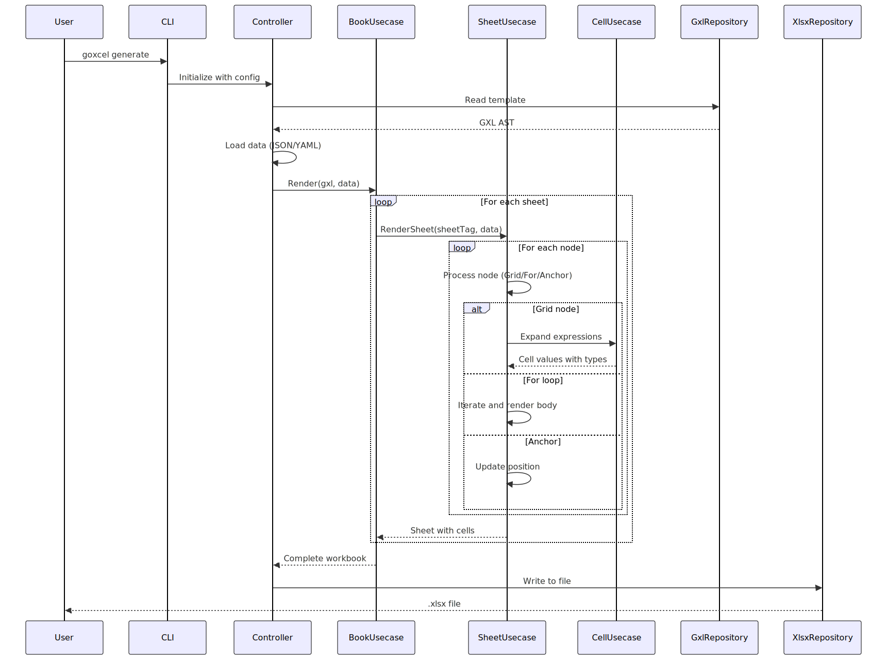

# goxcel

**Template-driven Excel generation library for Go**

Generate Excel (.xlsx) files from human-readable grid templates. Combines Markdown-like syntax with programmatic Excel generation power.

## Architecture Overview

### System Architecture



The architecture follows Clean Architecture principles with clear separation of concerns:

- **Input Layer**: GXL templates and data files (JSON/YAML)
- **Application Layer**: CLI tool and Go library interface
- **Config Layer**: Dependency injection with BaseConfig and Logger
- **Controller Layer**: Command handlers and request routing
- **Business Logic**: Usecase layer (Book → Sheet → Cell)
- **Data Access**: Repository layer for parsing and writing
- **Models**: Strongly-typed data structures (GXL AST, XLSX models)
- **Output Layer**: Generated Excel files

### Processing Flow



The processing follows this sequence:

1. **Parse**: Read GXL template and parse into AST
2. **Load**: Read JSON/YAML data file
3. **Render**: Transform template + data into workbook
   - BookUsecase orchestrates sheet rendering
   - SheetUsecase processes nodes (Grid, For, Anchor)
   - CellUsecase expands expressions and infers types
4. **Generate**: Create OOXML structure with styles
5. **Write**: Output .xlsx file

## Why goxcel?

- **Visual Templates**: Grid-oriented templates that look like your Excel output
- **Data-Driven**: Separate data from layout using JSON contexts
- **Pure Go**: No external dependencies, no C libraries
- **Type-Safe**: Strong typing with compile-time safety
- **Extensible**: Formulas, merges, images, charts, and more

## Features

✅ Grid templates with pipe-delimited syntax  
✅ Value interpolation (`{{ expr }}`)  
✅ Control structures (For loops, conditionals)  
✅ Excel formulas  
✅ Cell merging  
✅ Components (Images, Shapes, Charts)  
✅ Structured logging  
✅ CLI tool

## Quick Example

**Template (.gxl)**:
```xml
<Sheet name="Sales">
<Grid>| Product | Qty | Price |</Grid>
<For each="item in items">
<Grid>| {{ item.name }} | {{ item.qty }} | {{ item.price }} |</Grid>
</For>
</Sheet>
```

**Data (JSON)**:
```json
{"items": [{"name": "Apple", "qty": 10, "price": 100}]}
```

**Generate**:
```bash
goxcel generate --template report.gxl --data data.json --output report.xlsx
```

## Next Steps

- **New?** [Quick Start](./getting-started/quick-start.md)
- **Vision?** [Mission & Strategy](./vision-strategy.md)
- **Details?** [Specification](./specification/core-tags.md)

## Status & License

Active development. Core features stable. MIT License.

